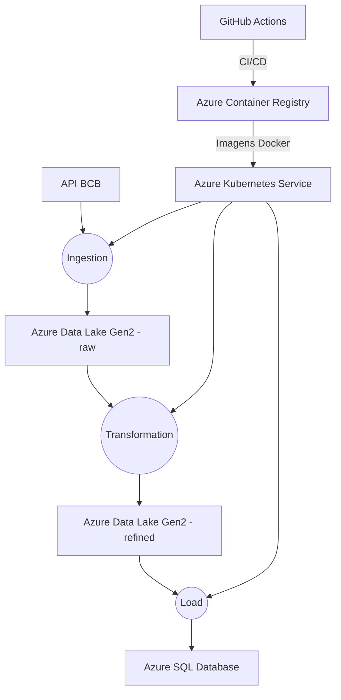

# Arquitetura do Pipeline de Dados

# Componentes:

1. ## Ingestion:
- Coleta dados via API do Banco Central
- Container: azcontaineregistryfiap.azurecr.io/ingestion:1.0.0
- Porta: 8080 (health checks)
2. ## Transformation:
- Processa dados JSON → CSV
- Container: azcontaineregistryfiap.azurecr.io/transformation:1.0.0
- Dependência: raw Data Lake container
3. ## Load:
- Carrega dados no Azure SQL
- Container: azcontaineregistryfiap.azurecr.io/load-sql:1.0.0
- Schema: dados_inflacao(orgao, categoria, ano, mes, valor)